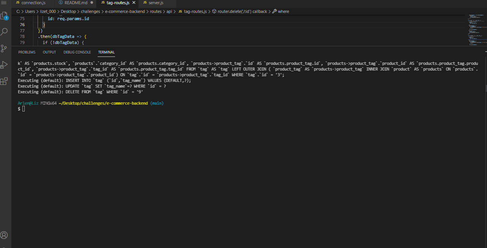
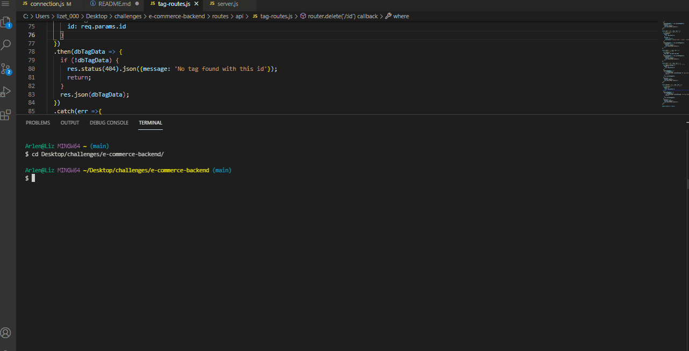
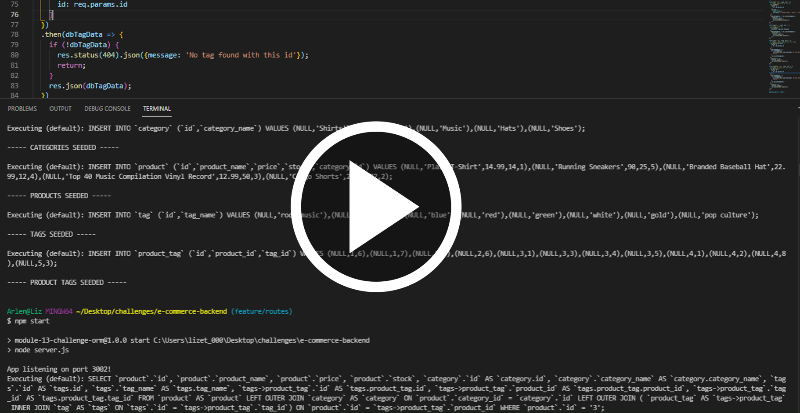

# E-commerce-backend

## Description
The back end for an e-commerce site. It works with a Express.js API and uses Sequelize to interact with a MySQL database.

  ## Table of Contents

* [Installation](#installation)
* [Usage](#usage)
* [License](#license)
* [Questions](#questions)
* [Functionality](#functionality)
* [Walkthrough Video](#video)

## Installation 
* The user needs to have Node.js installed, clone the repo, run `npm init` and `npm install` for the dependencies. After that, you need to install MySQL2, Sequelize, Express.js and dotenv, run:
 `npm install mysql2`
 `npm install sequelize`
 `npm install express`
 `npm install dotenv`

* To start the application, run:

`mysql -u root -p`

`source db/schema.sql` for the database.

`quit`

`npm run seed` to seed the tables.

`npm start` to start server.js.

## Usage
Understand the fundamental architecture of e-commerce sites.

## License

## Questions
If you have any questions about this project, send me an email at lizethariasc14@gmail.com or contact me through my [GitHub](https://github.com/lizariasc).

## Functionality

## Video
Click the following image to see a walkthrough video of the application

